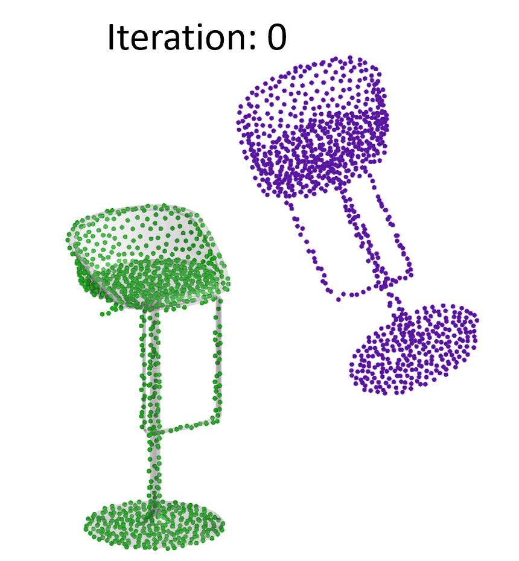
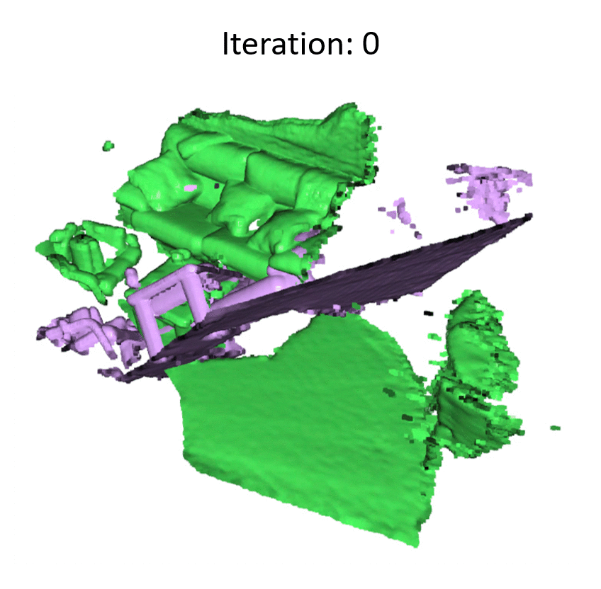
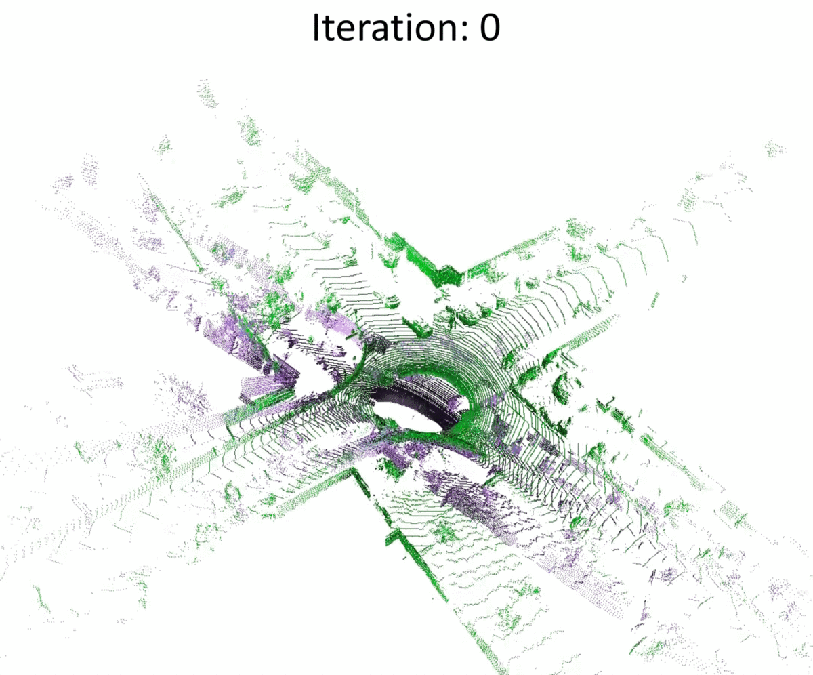

## [PointNetLK Revisited](https://arxiv.org/pdf/2008.09527.pdf)
[](https://opensource.org/licenses/MIT)

[Xueqian Li](https://lilac-lee.github.io/), [Jhony Kaesemodel Pontes](https://jhonykaesemodel.com/), 
[Simon Lucey](https://www.adelaide.edu.au/directory/simon.lucey)

Will appear on 2021 Conference on Computer Vision and Pattern Recognition (CVPR) (**oral**)

arXiv link: https://arxiv.org/pdf/2008.09527.pdf


| ModelNet40 | 3DMatch | KITTI |
|:-:|:-:|:-:|
| |  |  |

### Prerequisites
This code is based on PyTorch implementation, and tested on 1.0.0<=torch<=1.6.0. You may go to the PyTorch official site (https://pytorch.org/) to decide which torch/torchvision version is suitable for your system. You may also need to go to the tensorflow website (https://www.tensorflow.org/install) to download tensorboard. Other packages can be installed through,
```
pip install -r requirements.txt
```
**NOTE**: we use open3d interactive visualization window in the jupyter notebook, which is only available for open3d>=0.13.0.


### Demo Notebook
We provide a jupyter notebook (you may need to install the jupyter notebook) of toy example in the demo folder. 
You can run ./demo/test_toysample.ipynb to play with a point cloud pairs from 3DMatch dataset.
Note that the open3d visualization might not work in the notebook.


### Dataset
You may download dataset used in the paper from these websites.

| ModelNet40 | ShapeNet | KITTI   |
|:-:|:-:|:-:|
| https://modelnet.cs.princeton.edu | https://shapenet.org | http://www.cvlibs.net/datasets/kitti/eval_odometry.php |

We used 3DMatch dataset prepared by authors of Deep Global Registration, you may download using this script provided by them, https://github.com/chrischoy/DeepGlobalRegistration/blob/master/scripts/download_3dmatch.sh.

After you download the dataset, you can create a symbolic link in the ./dataset folder as ```./dataset/ModelNet``` and ```./dataset/ThreeDMatch```.

### Training
```
python train.py
```

### Evaluation
```
python test.py
```


### Pre-Trained Models
You can find the pre-trained model in ***logs/model_trained_on_ModelNet40_model_best.pth***.
This model is trained on ModelNet40 dataset, and is used to produce most results (except results of trained/tested on 3DMatch dataset) in the paper.


### Acknowledgement
This code is mostly adapted from the original PointNetLK, https://github.com/hmgoforth/PointNetLK.

The 3DMatch data loader code was adapted from the Deep Global Registration, https://github.com/chrischoy/DeepGlobalRegistration.

Part of the data voxelization code was adapted from the SECOND, https://github.com/traveller59/second.pytorch.

Part of the metric computaion code was adapted from the Deep Closest Point, https://github.com/WangYueFt/dcp.


### Contributing
If you find the project useful for your research, you may cite,
```
@article{li2020pointnetlk_revisited,
  author    = {Li, Xueqian and Pontes, Jhony Kaesemodel and Lucey, Simon},
  title     = {PointNetLK Revisited},
  journal   = {arXiv preprint arXiv:2008.09527},
  year      = {2020},
}
```
